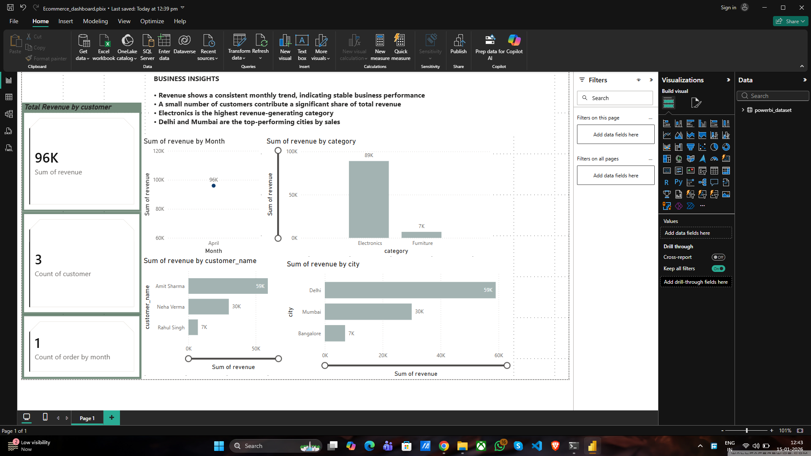

# 📊 E-Commerce Analytics Project (End-to-End)

## Overview
This project is an end-to-end data analytics case study built to understand sales performance of an e-commerce business.  
It covers the complete analytics workflow — from database design and SQL analysis to Python validation and Power BI visualization.

The objective of this project is to convert raw transactional data into meaningful business insights.

---

## Tools & Technologies
- **MySQL** – Database design, relationships, and analytical queries  
- **Python (Pandas)** – Data validation, transformation, and preparation  
- **Power BI** – Interactive dashboards and business insights  
- **GitHub** – Project documentation and version control  

---

## Database Design
The database consists of the following tables:
- `customers`
- `products`
- `orders`
- `order_items`

Primary and foreign key relationships are used to maintain data integrity.

---

## Business Questions Answered
1. What is the total revenue from delivered orders?  
2. Who are the top customers by total revenue?  
3. How many customers are repeat customers vs one-time customers?  
4. What is the monthly revenue trend?

---

## SQL Analysis
SQL was used to:
- Create the database schema
- Insert sample data
- Perform revenue calculations
- Analyze customer behavior
- Generate time-based insights using aggregations and window functions

All SQL queries are available in the `SQL` folder.

---

## Python Analysis
Python (Pandas) was used to:
- Load CSV data exported from MySQL
- Validate SQL results
- Perform customer-level revenue analysis
- Prepare a clean, aggregated dataset for Power BI

The Python notebook is available in the `Python` folder.

---

## Power BI Dashboard
An interactive Power BI dashboard was created to visualize:
- Total revenue KPIs
- Monthly revenue trend
- Top customers by revenue
- Revenue by category
- Revenue by city

Business insights are clearly highlighted to support decision-making.

---

## Key Insights
- Revenue shows a stable monthly trend for delivered orders  
- A small group of customers contributes a large share of total revenue  
- Electronics is the highest revenue-generating category  
- Delhi and Mumbai are the top-performing cities  

---

## Project Structure

---

## Dashboard Preview

---

## Conclusion
This project demonstrates practical data analytics skills including SQL querying, Python data analysis, and dashboard creation.  
It reflects how data can be transformed into insights that support real business decisions.

